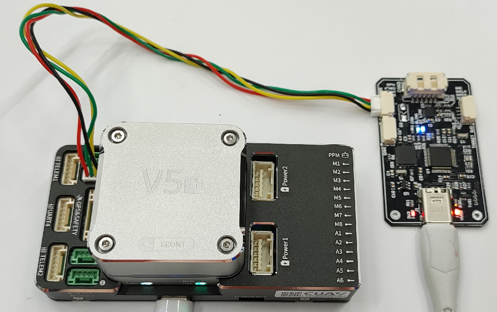
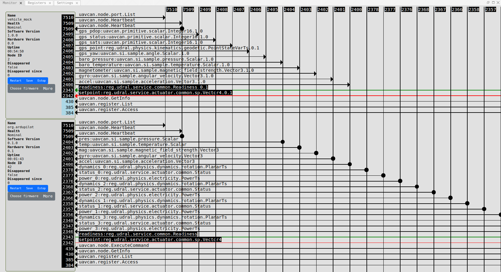
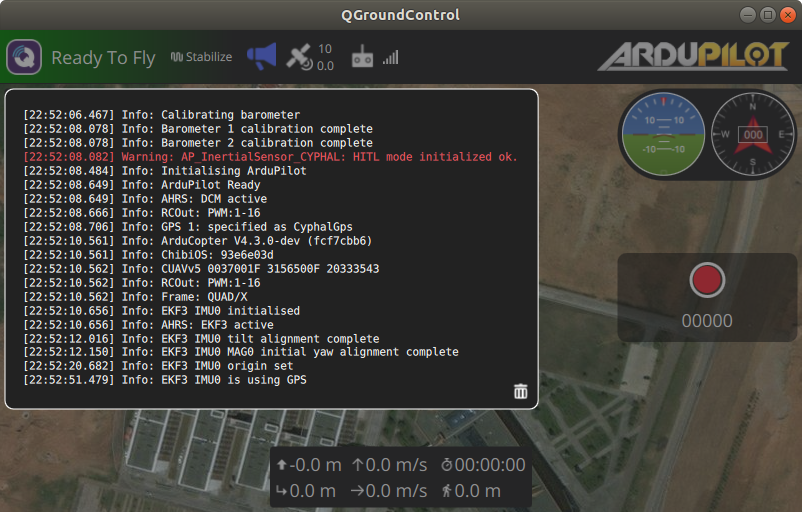

# Ardupilot Cyphal HITL simulation configuration

This page explains how to step by step configure Ardupilot to work with the Cyphal HITL simulator.

## Hardware Requirements

For HITL simulation you need the following hardware:

- Ardupilot compatible autopilot with CAN bus and at least 2 MB flash (tested on [cuav v5+](https://docs.px4.io/main/en/flight_controller/cuav_v5_plus.html))
- CAN-sniffer (for example [RaccoonLab sniffer](https://raccoonlabdev.github.io/docs/guide/programmer_sniffer/)).

An example of connection is shown below:



The autopilot and sniffer should be connected via any CAN bus.

## Software requirements

Software:
- The instruction based on [QGroundControl](http://qgroundcontrol.com/),
- [Ardupilot](https://ardupilot.org/) software,
- [Yakut](https://github.com/OpenCyphal/yakut) is a cli tool used for Ardupilot cyphal registers configuration.

It is expected that the autopilot and sniffer are connected with each other via CAN 1 bus.

## Step 1. Load firmware

First of all, you need to load the firmware with a few additional modifications relative to the master branch.

It is expected you already have downloaded the repository and everything is installed according to the [official manuals](https://ardupilot.org/dev/).

Checkout on [Cyphal HITL branch](https://github.com/PonomarevDA/ardupilot/tree/pr-uavcan-v1-hitl). 

Configure waf for your board. For CUAVv5 it is:

```bash
./waf configure --board CUAVv5
```

Then type the default command from the Ardupilot tutorial to build and load the firmware:

```bash
./waf --targets bin/arducopter --upload
```

## Step 2. Vehicle configuration

The configuration takes at least 10 minutes.

The detailed explanation and video example are below.

[](https://youtu.be/Dd_AazQgAzw)

**Step 1.** It is expected that you start with the default configuration of the autopilot.

- Press `Reset all to firmware default` button in QGC.
- Then press `Reboot Vehicle`.

The autopilot will send notifications that the vehicle is not configured yet. Let's fix it.

**Step 2.** Configure frame type.

At this moment the simulator supports only quadcopter mode. Go to the `Vehicle Setup`/`Frame` page and choose `Quad` and frame type `X`. Then reboot the vehicle.

After reboot the Frame warning on the `Vehicle Setup` should disappear.

**Step 3.** CAN-driver configuration

Let's configure the following parameters:

| Parameter         | Value |
| ----------------- | ----- |
| CAN_D1_PROTOCOL   | 13 (CYPHAL) |
| CAN_D2_PROTOCOL   | Disabled |
| CAN_P1_DRIVER     | First driver |

> At this moment the Ardupilot firmware expected to use cyphal only as CAN1.

> Until the Cyphal branch is not merged into the original Ardupilot firmware, it may require to choose `Advances settings` and `Manual Entry`. In this case it will show `Unknown`, but it is ok.

Then reboot the vehicle.

After reboot Cyphal registers related parameters will appear. You can verify it by searching `CAN_D1_UC1*` parameters in `Vehicle Setup` / `Parameters` window.

**Step 4.** Cyphal registers configuration

> This step and all the steps below might be done only with connected to your PC sniffer.

Since the Ardupilot custom firmware supports [register.Access](https://github.com/OpenCyphal/public_regulated_data_types/blob/master/uavcan/register/384.Access.1.0.dsdl) and [register.List](https://github.com/OpenCyphal/public_regulated_data_types/blob/master/uavcan/register/385.List.1.0.dsdl), the most recommended way to configure registers is to use [Yakut](https://github.com/OpenCyphal/yakut#node-configuration-example). Use instruction from [this repository](https://github.com/PonomarevDA/cyphal_configurator) to configure registers.

Alternatively, you can configure parameters manually through the parameters. This way is the most straightforward, but it is not recommended because it is easy to make a mistake during the configuration of a complex network. Although if you have a vehicle parameters file with already configured registers, you can load these parameters from the file.

After configuration, reboot the vehicle.

You may verify that `CAN_D1_UC1*` parameters are not empty after configuration to be sure that configuration is successful.

**Step 5.** IMU configuration

> This step and all the steps below might be done only with running simulator.

All board sensors should be disabled.

Firstly, check the existed accelerometers and gyro IDs by looking at `INS_ACC_ID`, `INS_ACC2_ID`, `INS_ACC3_ID` and `INS_GYR_ID`, `INS_GYR2_ID`, `INS_GYR3_ID` parameter values.

Let's say we have the following values:

| Parameter         | Value   | Note   |
| ----------------- | ------- | ------ |
| INS_ACC_ID        | 3801603 | cyphal |
| INS_ACC2_ID       | 2621706 | |
| INS_ACC3_ID       | 3080714 | |
| INS_GYR_ID        | 3801347 | cyphal |
| INS_GYR2_ID       | 2621706 | |
| INS_GYR3_ID       | 3080714 | |

So, we should make the following configuration:

| Parameter         | Value |
| ----------------- | ----- |
| EK3_IMU_MASK      | 1 |
| INS_ENABLE_MASK   | 1 |
| INS_ACC_ID        | 3801603 |
| INS_GYR_ID        | 3801347 |
| INS_USE           | Enabled |
| INS_USE2          | Disabled |
| INS_USE3          | Disabled |

Now changing the orientation of the real vehicle should not affect on the estimated orientation.

Go to the Sensors/Accelerometer to perform the calibration.

You should subsequently set each of 6 orientations shown on the QGC screen. To do so you need to send the number to the `/uav/calibrarion` topic from 11 to 16.

An example:

```bash
rostopic pub /uav/calibration std_msgs/UInt8 "data: 11"
```

When accelerometer calibration is finished, return the simulator into the default mode.

```bash
rostopic pub /uav/calibration std_msgs/UInt8 "data: 0"
```

Then run gyro calibration. It doesn't require to rotate the vehicle.

> Any ideas of an automatic accel calibration are welcome.

**Step 6.** Compass configuration

If IMU calibration is successful, go to the Sensors/Compass. It automatically detect which compasses are internal and external.

Let's say we have:

| Compass   | Value     |
| --------- | --------- |
| 1         | internal  |
| 2         | external  |

It means that first compass is onboard, and the second one is cyphal.

Go to the parameters and check the identifiers of the compasses.

Let's say we have the following values:

| Parameter         | Value   |
| ----------------- | ------- |
| COMPASS_DEV_ID    | 658945  |
| COMPASS_DEV_ID2   | 76291   |

The cyphal compass should be first and have the highest priority, and the internal sensor should be disabled. So, configure the following parameters:

| Parameter         | Value |
| ----------------- | ----- |
| COMPASS_PRIO1_ID  | 76291 |
| COMPASS_PRIO2_ID  | 658945 |
| COMPASS_USE       | Disabled |
| COMPASS_USE2      | Enabled |

Then reboot the vehicle.

Go to the Sensors/Compass and start the calibration.

Call the `scripts/calibrate_mag.sh` script and wait until the calibration is finished.

The calibration process may take more than 1 minute.

Reboot the vehicle after the calibration.

**Step 7.** Other settings

Gps configuration:

| Parameter         | Value       |
| ----------------- | ----------- |
| GPS_TYPE          | 24 (CYPHAL) |

> Until the Cyphal branch is not merged into the original Ardupilot firmware, it may require to choose `Advances settings` and `Manual Entry`. In this case it will show `Unknown`, but it is fine.

Safety configuration:

| Parameter         | Value    |
| ----------------- | -------- |
| BRD_SAFETYENABLE  | Disabled |
| FS_THR_ENABLE     | Disabled |

Control system configuration:

| Parameter         | Value |
| ----------------- | ----- |
| ATC_RAT_YAW_P     | 1.0   |
| ATC_RAT_PIT_P     | 0.35  |

Reboot the vehicle.

## Step 3. Verify with Yukon



## Step 4. Ready to fly

If the connection between the autopilot and the simulator is ok, the vehicle will be ready to fly. In the window with notification, it will always send a single warning about Cyphal IMU to remember you that you are in HITL mode and on custom firmware.



Fig. The vehicle is ready to fly

If the autopilot receives nothing from CAN-bus, it will be `Not Ready` and it will use dummy IMU measurements and notify about EKF and sensors such as Baro and Compass.

At this stage, the autopilot internal sensors should be disabled as well. If they are enabled, the simulation can't work properly. 

> It is necessary to initially connect the hardware with the simulator via sniffer, run the simulator, and only then power/reboot the vehicle. If the vehicle starts with no input data at the beginning it will not allow to fly.
