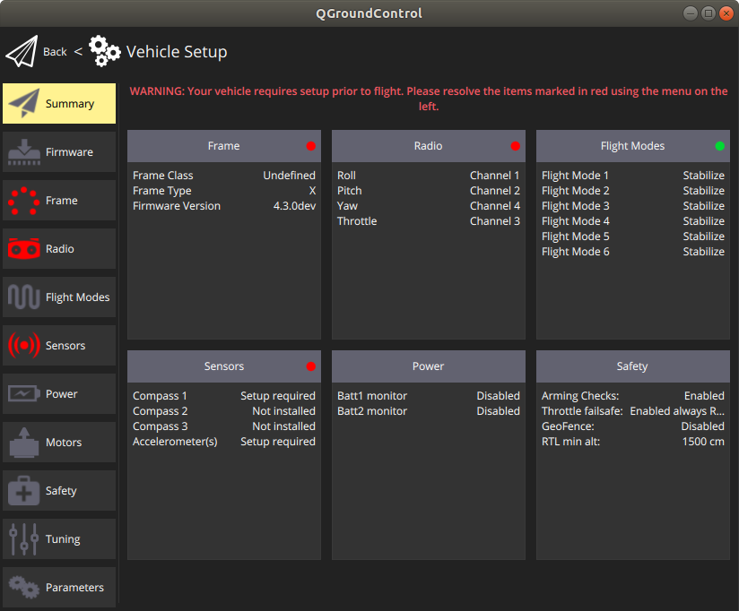
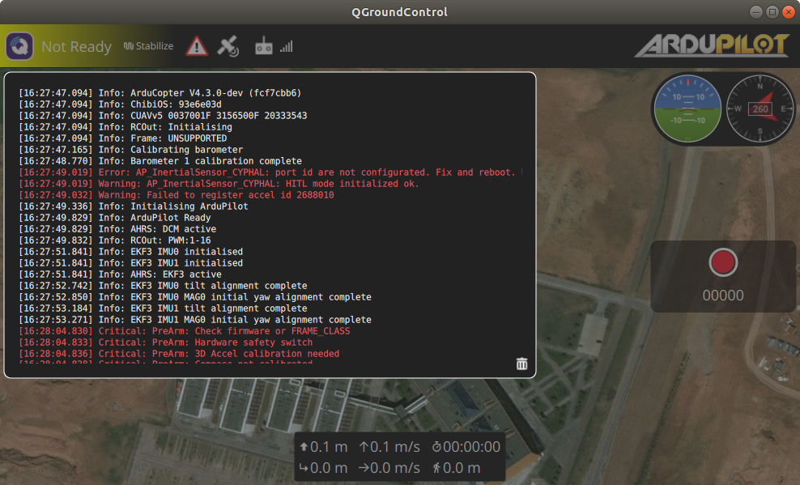
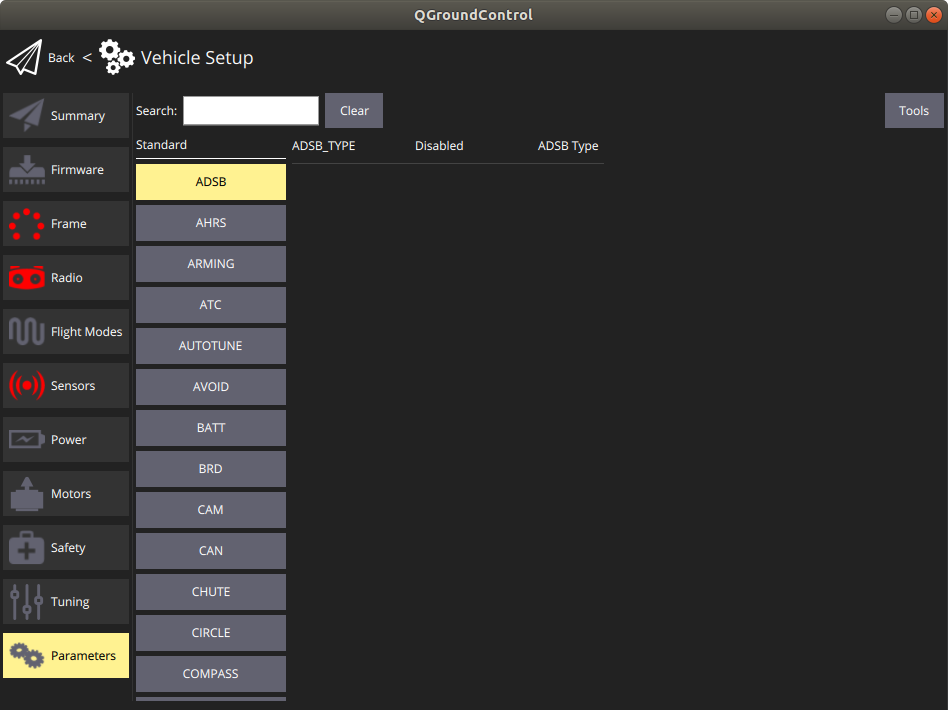
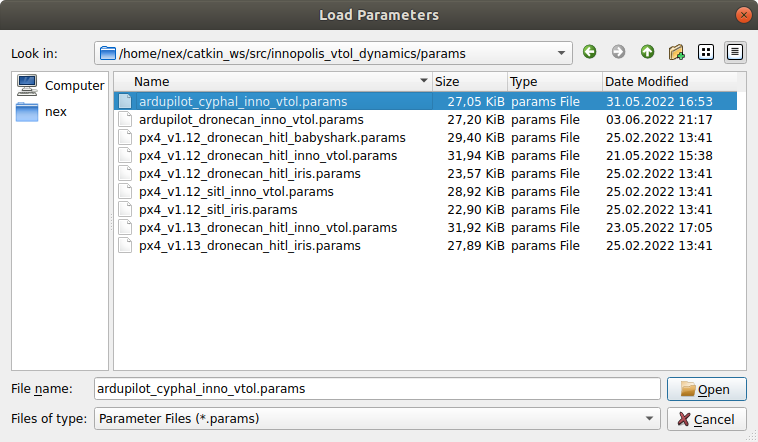
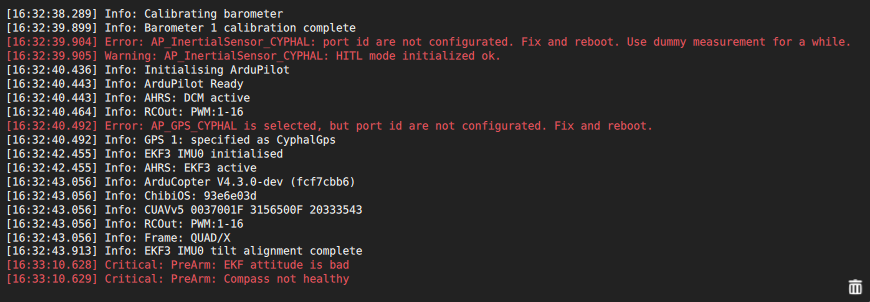
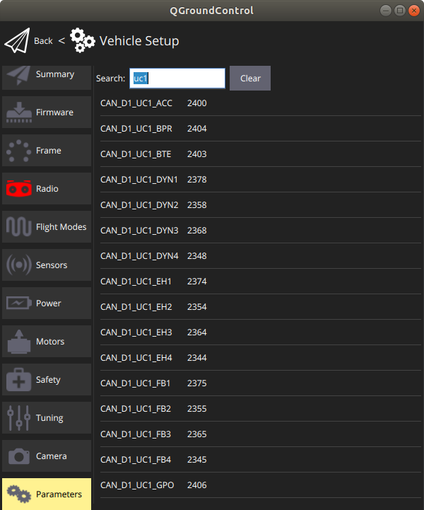

# Ardupilot Cyphal HITL simulation configuration

This page explains how to configure Ardupilot to work with Cyphal HITL simulator. It doesn't cover how to run the simulator itself.

## Requirements

You need the following hardware:

- CUAV V5+ autopilot or similar fmuv5,
- CAN-sniffer (for example [inno-programmer-sniffer](https://github.com/InnopolisAero/inno_uavcan_node_binaries/blob/master/doc/programmer_sniffer/README.md)).

The autopilot and sniffer should be connected via CAN 1 bus (second bus is not supported at this moment).

## 1. Load firmware

First of all you need to load the firmware with few additional modification relative to the master branch.

It is expected you already have downloaded repository and everything is installed according to the official manuals.

Checkout on [Cyphal HITL branch](https://github.com/PonomarevDA/ardupilot/tree/pr-uavcan-v1-hitl). Then type the default command from the Ardupilot tutorial to build and load the firmware:

```bash
./waf --targets bin/arducopter --upload
```

## 2. Load parameters

Let's say you start with the default configuration of the autopilot (after pressing `Reset all to firmware default`).

You will see something like on the picture below:




Fig. The default state of the autopilot illustrated in QGC

The autopilot will send notifications that vehicle is not configured yet.

There are 2 ways of configuration.

1. You can manually set all required parameters
2. Load them from the file

Below it is described how to load them.

<details><summary>Click to expand the list of required parameters</summary>
<p>

1. Base configuration

| Parameter         | Value |
| ----------------- | ----- |
| FRAME_CLASS       | Quad |
| CAN_D1_PROTOCOL   | 12 (CYPHAL) |
| CAN_D2_PROTOCOL   | Disabled |
| CAN_P1_DRIVER     | First driver |
| BRD_SAFETYENABLE  | Disabled |
| FS_THR_ENABLE     | Disabled |

2. Gps configuration

| Parameter         | Value |
| ----------------- | ----- |
| GPS_TYPE          | 24 (CYPHAL) |

3. Compass configuration

| Parameter         | Value |
| ----------------- | ----- |
| COMPASS_DEV_ID    | 76291 |
| COMPASS_ENABLE    | Enabled |
| COMPASS_EXTERNAL  | External |
| COMPASS_ENABLE    | Enabled |
| COMPASS_PRIO1_ID  | 76291 |
| COMPASS_USE       | Enabled |
| COMPASS_USE2      | Disabled |
| COMPASS_USE3      | Disabled |

+ calibration

4. IMU configuration

| Parameter         | Value |
| ----------------- | ----- |
| EK3_IMU_MASK      | 1 |
| INS_ENABLE_MASK   | 1 |
| INS_ACC_ID        | 3801603 |
| INS_GYR_ID        | 3801347 |
| INS_USE2          | Disabled |
| INS_USE3          | Disabled |

+ calibration

5. Control

| Parameter         | Value |
| ----------------- | ----- |
| ATC_RAT_YAW_P     | 1.0 |
| ATC_RAT_PIT_P     | 0.35 |


</p>
</details>

The easiest way configure the vehicle is to load parameters to the vehicle from the file. Just press `load from file` button and choose corresponded [file with parameters]().

The example how to do it is illustrated on the pictures below:




Fig. Loading parameters to the autopilot in QGC

Accept all suggested parameters changes and reboot the autopilot.

> Note: if the QGC application terminated unexpectedly, just run it again and press the reboot vehicle button.

## 3. Load registers

After reboot the Cyphal driver will be activated on CAN 1 bus, but the Cyphal specific parameters have not been not loaded yet because they appear only when Cyphal is enabled. Typically, the autopilot will show you following errors.



Fig. Errors and warnings after first load

The Ardupilot parameters is the storage for Cyphal registers which are particularly are used for port identifier configuration.

Here 3 ways of port identifier configuration are described.

1. You may configure the node manually via QGC parameters interface. This way is the most straightforward, but it is not recommended because it is easy to make a mistake during configuration of complex network.
2. You can use [Yakut](https://github.com/OpenCyphal/yakut#node-configuration-example) to make an automatic node configuration via [register.Access](https://github.com/OpenCyphal/public_regulated_data_types/blob/master/uavcan/register/384.Access.1.0.dsdl) and [register.List](https://github.com/OpenCyphal/public_regulated_data_types/blob/master/uavcan/register/385.List.1.0.dsdl) which are supported by the Ardupilot firmware. It is the most recommended way because it allows to automatically configure other network components as well. An example of how to do it will appear soon.
3. Just now the most fastest and easier way is to perform configuration in the same way as parameters. Just load parameters from the same file one more time. Loading parameters from the file allows also to skip the next step of the sensors calibration.

Since registers configuration is performed once only during firmware initialization, you need to reboot the autopilot as well.

After reboot you can verify that your registers were successfully configured. An example is shown on the picture below.



Fig. Configured Cyphal registers

## 4. Sensor calibration

You can skip this step if you configure the autopilot Cyphal node by loading the parameters from the file.

> This section will be completed later. For now just load the parameters as described on the previous step. If you need to do it anyway, look at `/uav/calibration` topics for details.

## 5. Ready to fly

If the connection between the autopilot and the simulator is ok, the vehicle will be ready to fly. In the window with notification it will always send a single warning about Cyphal IMU to remember you that you are in HITL mode and on a custom firmware.


Fig. The vehicle is ready to fly

If the autopilot receives nothing from CAN-bus, it will be `Not Ready` and it will use dummy IMU measurements and notify about EKF and sensors such as Baro and Compass.

At this stage, the autopilot internal sensors should be disabled as well. If they are enabled, the simulation can't work properly. 

> Note 1. I can foresee some problems on autopilot other than CUAV V5+, but you can try to handle them by yourself.

> Note 2. It is necessary to initially connect the hardware with the simulator via sniffer, run the simulator and only then power/reboot the vehicle. If the vehicle starts with no input data at the beginning it will not allow to fly.
